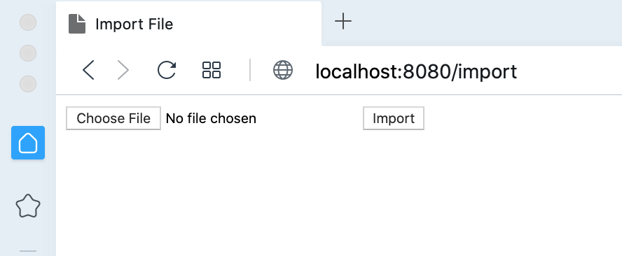
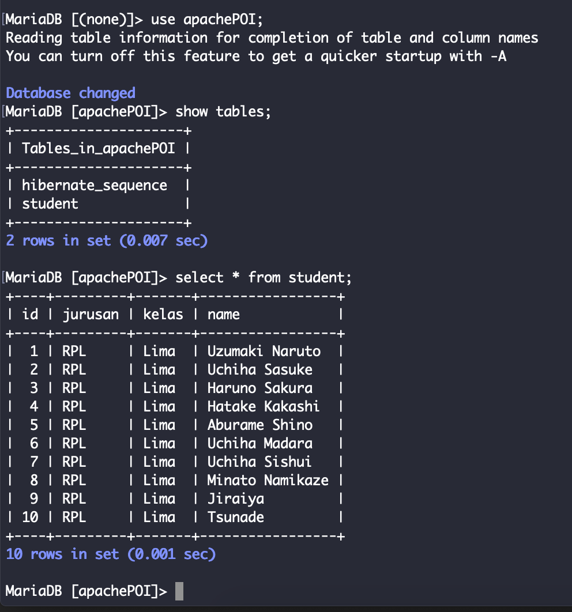

# springboot-export-import-excel-poi

## Things to do list:
1. Clone this repository: `git clone https://github.com/hendisantika/springboot-export-import-excel-poi.git`
2. Go to folder: `springboot-export-import-excel-poi`
3. Run the application: `mvn clean spring-boot:run`
4. Navigate to browser: http://localhost:8080/import
4. Navigate to browser: http://localhost:8080/export

## Screen shot

Import File

MySQL Database

